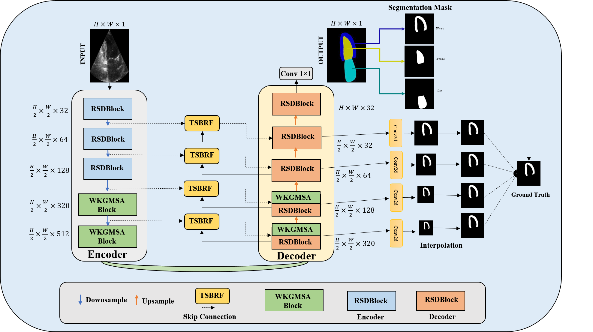

# W-KANet

[](https://www.python.org/downloads/)
[](https://pytorch.org/)
[](https://opensource.org/licenses/MIT)

Official PyTorch implementation.

## Architecture

<p align="center">
  
</p>

## Installation

```bash
git clone https://github.com/Hassan48khan/W-KANet.git
cd W-KANet
pip install -r requirements.txt
```

## Usage

```python
from W_KANet import MSAWKNet
import torch

model = MSAWKNet(num_classes=1, input_channels=1, img_size=128).cuda()
x = torch.randn(2, 1, 128, 128).cuda()
output = model(x)
```

## Files

- `W_KANet.py` - Model architecture
- `loss.py` - Loss functions
- `train.py` - Training script
- `utils.py` - Utilities

## Citation

Details available upon publication.

## License

MIT License

## Contact

Hassan Khan - [@Hassan48khan](https://github.com/Hassan48khan)
